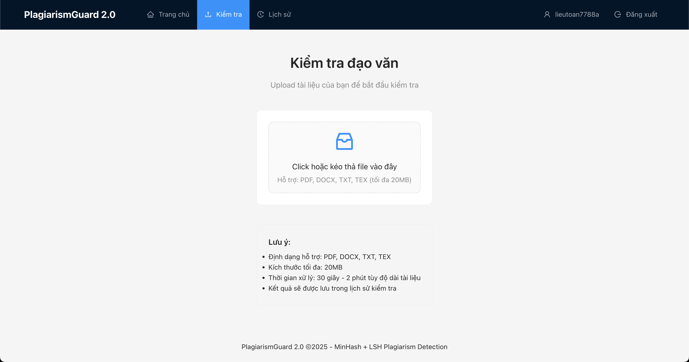
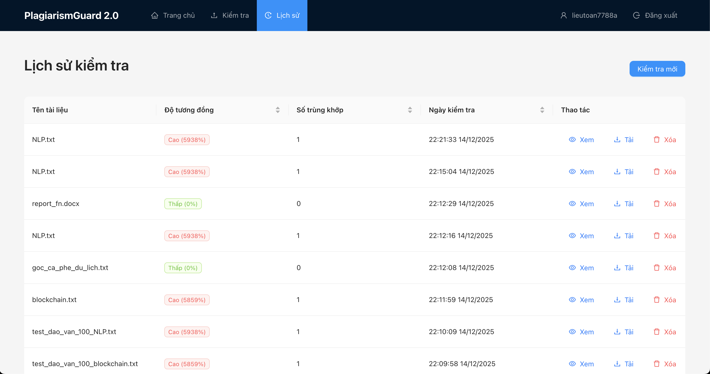

# PlagiarismGuard 2.0

Industrial-grade plagiarism detection system using MinHash + LSH for near-duplicate detection.

## 📸 Preview

<p align="center">
  
  <br><em>Trang Upload - Tải lên tài liệu cần kiểm tra</em>
</p>

<p align="center">
  
  <br><em>Trang Kết Quả - Hiển thị độ tương đồng và nguồn trùng khớp</em>
</p>

<p align="center">
  
  <br><em>Trang Lịch Sử - Quản lý các lần kiểm tra</em>
</p>

## 🎯 Features

- **MinHash + LSH Algorithm**: Fast similarity detection without ML training
- **Vietnamese NLP**: Optimized for Vietnamese text with `underthesea`
- **Scalable**: Handles 1M+ documents with Redis LSH indexing
- **High Accuracy**: Precision ≥ 90%, Recall ≥ 85%
- **Fast**: Query latency < 500ms

## 🏗️ Architecture

```
Backend:  FastAPI + Celery + Redis + PostgreSQL + S3
Frontend: React 18 + TypeScript + Ant Design
Algorithm: datasketch (MinHash/LSH) + underthesea (Vietnamese NLP)
```

## 📚 Documentation

See `/docs/plan/` for detailed documentation:
- **[PROMPT.md](./docs/plan/PROMPT.md)** - Prompt to start implementation
- **[IMPLEMENTATION_STEPS.md](./docs/plan/IMPLEMENTATION_STEPS.md)** - Step-by-step guide
- **[README.md](./docs/plan/README.md)** - Documentation index

## 🚀 Quick Start

### Prerequisites

- Python 3.9+
- Node.js 18+
- Docker & Docker Compose
- PostgreSQL 15+
- Redis 7+

### One-Command Setup

```bash
# Clone repository
git clone <repo-url>
cd Phat-Hien-Dao-Van-MinHash-LSH

# Run setup script (installs all dependencies)
chmod +x scripts/*.sh
./scripts/setup.sh
```

### Start Development

```bash
# Start both backend and frontend
./scripts/run-dev.sh

# Access:
# - Frontend:  http://localhost:3000
# - Backend:   http://localhost:8000
# - API Docs:  http://localhost:8000/docs
```

### Manual Setup (Alternative)

<details>
<summary>Click to expand manual setup instructions</summary>

#### 1. Start Services

```bash
# Start Redis, PostgreSQL, MinIO
docker-compose up -d

# Wait for services to be healthy
docker-compose ps
```

#### 2. Setup Backend

```bash
cd backend

# Create virtual environment
python -m venv venv
venv\Scripts\activate  # On IOS: source venv/bin/activate

# Install dependencies
pip install -r requirements.txt

# Copy environment file
cp ../.env.example .env


# Run backend
uvicorn app.main:app --reload --port 8000
```

Backend will be available at http://localhost:8000

#### 3. Setup Frontend

```bash
cd frontend
npm install
npm start
```

Frontend will be available at http://localhost:3000

</details>

## 📊 Current Progress

- [x] **Phase 1: Project Setup** (14 files) - COMPLETED
  - [x] Directory structure
  - [x] Docker Compose services
  - [x] Database schema
  - [x] Configuration files
  - [x] Pydantic models
  
- [x] **Phase 2: Core Algorithm** (14 files) - COMPLETED
  - [x] MinHash generator
  - [x] LSH indexer
  - [x] Text preprocessing
  - [x] Similarity calculator
  
- [x] **Phase 3: API Layer** (10 files) - COMPLETED
  - [x] FastAPI endpoints
  - [x] Celery tasks
  - [x] WebSocket support
  - [x] Authentication
  
- [x] **Phase 4: Frontend** (19 files) - COMPLETED
  - [x] React components
  - [x] Custom hooks
  - [x] Pages and routing
  - [x] API integration
  
- [x] **Phase 5: Testing** (4 files) - COMPLETED
  - [x] Unit tests
  - [x] Component tests
  
- [x] **Phase 6: Dev Scripts** (3 files) - COMPLETED
  - [x] Setup script
  - [x] Run script
  - [x] Test script

**Total: 64 files created**

## 🧪 Testing

```bash
# Run all tests (backend + frontend)
./scripts/run-tests.sh

# Run only backend tests
cd backend && pytest tests/ -v --cov=app

# Run only frontend tests
cd frontend && npm test

# View coverage reports
open test-results/backend-coverage/index.html
open test-results/frontend-coverage/lcov-report/index.html
```

## 🛠️ Development Scripts

| Script | Description |
|--------|-------------|
| `scripts/setup.sh` | Install all dependencies (one-time setup) |
| `scripts/run-dev.sh` | Start backend + frontend concurrently |
| `scripts/run-tests.sh` | Run all tests with coverage reports |

## 📁 Project Structure

```
├── backend/              # FastAPI backend
│   ├── app/
│   │   ├── api/         # API endpoints
│   │   ├── core/        # Core config
│   │   ├── db/          # Database
│   │   ├── models/      # SQLAlchemy models
│   │   ├── schemas/     # Pydantic schemas
│   │   └── services/    # Business logic
│   └── tests/           # Backend tests
├── frontend/            # React frontend
│   ├── src/
│   │   ├── components/  # React components
│   │   ├── hooks/       # Custom hooks
│   │   ├── pages/       # Page components
│   │   └── services/    # API services
│   └── __tests__/       # Frontend tests
├── scripts/             # Development scripts
├── docs/                # Documentation
└── docker-compose.yml   # Docker services
```

## 📝 License

MIT License

## 👥 Contributors

- AI Model Implementation Team
